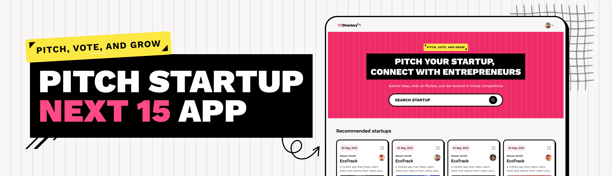

# ✨ Starty - Startup Pitch Platform ✨

> Where entrepreneurs connect, pitch ideas, and grow together.

## 🚀 About

Starty is a dynamic platform that enables entrepreneurs to pitch their startup
ideas, connect with like-minded individuals, and participate in virtual
competitions. The platform facilitates idea submission, community voting, and
helps innovative startups get noticed.

## 🎯 Features

- 📝 Submit and showcase your startup ideas
- 🗳️ Vote on pitches from other entrepreneurs
- 🌐 Connect with a community of innovative thinkers
- 🏆 Participate in virtual competitions
- 🔍 Search functionality to discover relevant startups

## 🛠️ Tech Stack

- **Frontend**: [Next.js](https://nextjs.org/) (v15), React 19
- **Styling**: [Tailwind CSS](https://tailwindcss.com/) (v4)
- **CMS**: [Sanity](https://www.sanity.io/)
- **Authentication**: Next-Auth
- **Markdown**: Supports markdown content with markdown-it

## 💻 Installation

```bash
# Clone the repository
git clone https://github.com/yourusername/starty.git
cd starty

# Install dependencies
pnpm install

# Generate Sanity types
pnpm run typegen

# Start development server
pnpm run dev
```

## 🚦 Getting Started

After installation, your development server will be running at
`http://localhost:3000`. The project uses Sanity for content management, so you
may need to configure your Sanity project settings.

## 🌟 Usage

- Browse submitted startup pitches
- Create an account to submit your own ideas
- Vote on pitches you find promising
- Connect with entrepreneurs who share your interests

## 🤝 Contributing

Contributions are welcome! Please feel free to submit a Pull Request.

1. Fork the repository
2. Create your feature branch (`git checkout -b feature/amazing-feature`)
3. Commit your changes (`git commit -m 'Add some amazing feature'`)
4. Push to the branch (`git push origin feature/amazing-feature`)
5. Open a Pull Request

> Idea credit goes to [JS Mastery](https://www.youtube.com/@javascriptmastery)
> The project is inspired by their video on building a startup pitch platform.

## 📄 License

This project is licensed under the MIT License - see the LICENSE file for
details.

## 📬 Contact

For any questions or suggestions, please open an issue or contact the project
maintainers.

---

Built with ❤️ by [Piush Bose]
